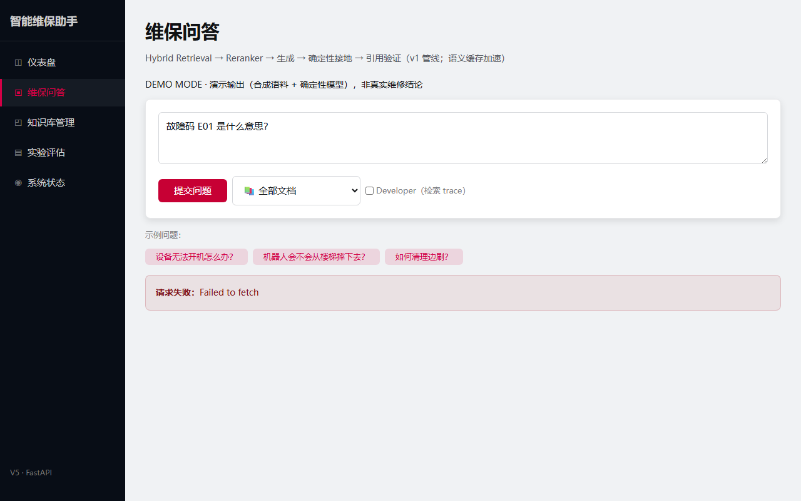

# 多模态可信 RAG 智能硬件维保知识助手

**Production-style Multimodal RAG & Evaluation System**

面向智能硬件说明书、故障手册等非结构化文档的知识问答系统，覆盖文档摄取、VLM 辅助图像理解、Hybrid Retrieval、Cross-Encoder Reranking、确定性 Grounding、Citation 验证、Semantic Cache、Evaluation 与完整应用工程链路（FastAPI + React + CI/Docker/Demo Mode）。

> ⚠️ 本项目为 AI Application / RAG Engineering 实践项目，输出仅供参考，**不构成设备维修或医疗建议**。

---

## Hero



> 真实 UI 截图（DEMO Mode 下问答：答案 + 引用 + Grounding 徽章 + DEMO 标记）。

## Key Engineering Metrics（当前 commit 实测）

| Metric | Result |
|---|---:|
| Backend tests（CI 子集） | **226 passed / 89 deselected**（CI 全绿） |
| Backend coverage（branch-adjusted TOTAL） | **72.46%**（CI 子集，gate=70）· 本地全量 **77.8%** |
| Typecheck（mypy） | **0 errors**（54 files） |
| ruff check / format | ✅ |
| Frontend unit tests（Vitest+RTL） | **7 passed** |
| Playwright E2E（Demo Mode） | **7/7**（本地全新缓存 + CI 实测） |
| Demo retrieval benchmark（Recall@5 / MRR / nDCG@5） | **0.9167 / 0.9167 / 0.8792**（run `demo_retrieval_v1`） |
| Semantic cache（exact hit / false-hit rate） | **12/12 / 0.0** |
| Critical modules coverage | retrieval 86~89% · grounding 92% · cache 94% · gateway 84% |

> 全部数字来自当前 commit 真实执行；口径与明细见 [docs/evaluation/CURRENT_RESUME_METRICS.md](docs/evaluation/CURRENT_RESUME_METRICS.md)。
> **真实模型 full benchmark（BGE-M3/Milvus/LLM，golden_100/extended_123）：NOT RUN**（需 GPU + 模型权重 + API key；当前环境未重跑）。
> 历史 V0–V9 benchmark 见 [Historical Results](#historical-experiment-results-v0v9)（重构后未重跑 → NOT VERIFIED AFTER REFACTOR）。

## 核心架构

```text
User (React 19 + Vite)
   │ HTTP / SSE
   ▼
FastAPI (RequestID / 统一错误 envelope / Prometheus /metrics)
   │
   ▼
RAGService (src/api/services/rag_service.py — 分阶段计时 + SSE stage 事件)
   │
   ├─ SemanticCache (exact SHA256 + embedding-cosine 语义命中；
   │                 key = doc_filter|corpus_version|schema:v1 防 stale)
   │
   ▼
RerankedRetriever (二阶段)
   ├─ Stage1 HybridRetriever: BGE-M3 Dense + BM25 (jieba) → RRF 融合 (top-20)
   ├─ Stage2 Cross-Encoder Reranker (BGE-Reranker) → top-5
   ▼
Generator (LLM, Prompt Registry + 注入防御 <untrusted>)
   ▼
GroundingVerifier (句级 Cross-Encoder 确定性接地；默认 scorer=reranker)
   ▼
Citation Validator（引用由系统从真实检索结果计算，非 LLM 声称）
   ▼
Cite-or-Abstain（answered / refused）
```

## RAG Pipeline（当前实现）

```text
Document
  ↓
Parse（文本 / 表格；图片经 VLM caption 转语义描述，见下方多模态说明）
  ↓
Chunking + Metadata（chunk_id 稳定派生 document_id|page|index）
  ↓
BGE-M3 Dense Retrieval（top-20）   +   BM25 Sparse Retrieval（jieba, top-20）
  ↓
RRF Fusion（k=60，只看排名不看分数）
  ↓
Cross-Encoder Reranker（top-5）
  ↓
LLM Generation
  ↓
Deterministic Grounding（句级 Cross-Encoder 支持验证）
  ↓
Citation Validation
  ↓
Answer / Warning / Abstain
  ↓
Semantic Cache（exact + semantic，corpus/schema/doc_filter 绑定）
```

## 多模态路径（诚实说明）

当前多模态是 **caption-based（VLM 辅助图像理解）**，**不是** native image-text joint embedding：

```text
PDF Page / Figure
  → VLM semantic description（caption，经 VLMClient / scripts/ingest_v1.py 摄取脚本）
  → chunk metadata
  → BGE-M3 text embedding
  → Hybrid Retrieval（与正文同一文本检索链路）
```

- 图片不参与联合向量编码；描述性文本进入标准文本检索/缓存/grounding 链路。
- 局限：caption 丢失图像细节，且 caption 属 untrusted content（注入面）——见 Known Limitations。

## Hybrid Retrieval（为什么这样设计）

- **BGE-M3（Bi-Encoder）**：语义近似（"无法开机" ↔ "电源故障"），query 与 doc 独立编码 → 可预计算向量 → 快。
- **BM25（Sparse，jieba 分词）**：精确术语（"PTC"、"E07"、型号名）在向量空间会被稀释，关键词匹配是硬需求。
- **RRF 融合**：`score = Σ 1/(k + rank)`，只看排名不看分数 → 不需要归一化 dense cosine 与 BM25 无界频率分（量纲不同不能直接相加）。k=60 偏向"两路都靠前"的项。
- **Cross-Encoder Reranker（Stage 2）**：query+doc 拼接联合编码 → 精确但慢 → 只对 top-20 精排取 top-5（质量-延迟 Pareto）。

参数全部配置化（`retrieval_rrf_k / dense_top_k / bm25_top_k / rerank_candidate_k / final_top_k`），无 magic number。

## Grounding / Citation / Abstain

- **Grounding**：答案拆句 → 每句与检索 chunk 用 **Cross-Encoder（默认 scorer=reranker）** 联合打分 → 无支撑句子标记。阈值经 `scripts/calibrate_grounding.py` 校准曲线辅助选择（settings 硬编码默认值，非自动回写）。
- **诚实边界**：这是 **deterministic relevance-based grounding**（句级支持验证），`relevance ≠ entailment`——交叉编码器拦不住"主题相关但编造"（Frankenstein 边界）。目标是**降低 unsupported claims**，并对低证据支持回答执行警告或拒答；**不是"消除幻觉"**。
- **Cite-or-Abstain**：输出状态 `ANSWER / ANSWER_WITH_WARNING / ABSTAIN`（前端展示 Supported / Warning / Abstained）。证据不足 → 拒答，不硬答。
- **Citation Validator**：引用（chunk_id/source/page）由系统从**真实检索结果**计算（来源/页码来自 chunk metadata），不允许 LLM 自行写页码 → 不存在"引用第 37 页但第 37 页不存在"。
- **LangGraph workflow orchestration**：单一 StateGraph 验证流程（retrieve → check relevance → generate → verify → decide，最多 1 次重试），**不是 Multi-Agent / Agentic RAG**。

## Evaluation & Experimentation

- **Retrieval 指标**（`src/eval/retrieval_metrics.py`）：Recall@K / HitRate@K / Precision@K / MRR / nDCG@K（K∈{1,3,5,10,20}）。
- **Generation 指标**：LLM-as-Judge（RAGAS 0.4.3：faithfulness / context precision / context recall；脚本实现 answer_relevancy）。
- **Citation**：确定性三态 `citation_accuracy`（来源匹配 / 页面存在 / 证据支撑）+ 句级引用审计。
- **Reliability**：12 类确定性 Failure Taxonomy（RETRIEVAL_MISS / RERANKER_REGRESSION / CACHE_FALSE_HIT / GENERATION_HALLUCINATION / OVER_REFUSAL / UNDER_REFUSAL…），输出 failures.jsonl。
- **统计检验**：Bootstrap 95% CI + McNemar 配对比较（`src/eval/stats.py`）——0.858 → 0.861 不宣称"显著提升"。
- **Experiment Registry**（`runs/<run_id>/`）：config / metadata（git_commit、dataset_hash、corpus_version）/ metrics / failures / report；README 每个 benchmark 可追溯 run_id。
- **防 leakage**：calibration/test split 分离，禁止用 test set 反复调参。

### Current Verified Benchmark（demo corpus，run `demo_retrieval_v1`）

| Pipeline | Recall@5 | MRR | nDCG@5 | 说明 |
|---|---:|---:|---:|---|
| Demo Hybrid + Rerank（合成语料，12 题） | **0.9167** | **0.9167** | **0.8792** | 确定性可复现（CI 离线回归） |

> 真实 BGE-M3/Milvus/LLM benchmark：**NOT RUN**（需 GPU + 模型权重 + API key；`scripts/final_evaluation.py` 就绪）。

## Semantic Cache & Incremental Index

- **Cache scope 绑定（非简单 query hash）**：key = SHA256(规范化 query + salt)，salt 含 **doc_filter + corpus_version + schema:v1**——知识库更新或响应契约变化 → 自动失效；doc_filter 隔离跨文档命中。两级命中：exact（SHA256）→ semantic（embedding-cosine ≥ 阈值 0.9 的释义命中）。
- **Cache eval 指标**：hit rate 之外重点看 **false-hit rate**（相似 ≠ 同义），当前 demo 基准 false-hit = 0.0。
- **Incremental Index**：文件级 SHA256 manifest 原子写（tmp + rename）；per-file 容错；chunk_id 稳定派生——**避免对未变更文档重复索引**。Milvus Lite 无事务 → 删除旧+写新非原子（文档化限制）。

## Application Features

- **Q&A**：v1 契约（answer / citations / grounding / usage / latency / cache / request_id）；后端提供 SSE 流式端点（`/api/v1/query/stream`：stage 事件 + demo token 流）与停止生成（CancelledError 不包装 500）。
- **Evidence Panel（developer）**：Dense rank / BM25 rank / RRF score / Rerank score / chunk_id / page——证明 Hybrid Retrieval 真实实现。
- **Citation UI**：点击引用展开 source/page/excerpt + 各通道分数。
- **Knowledge Base**：文档列表（demo 内置语料）/ 上传（真实模式，MAX_UPLOAD_MB / MAX_PDF_PAGES 配置化）。
- **Experiments 页面**：从 Experiment Registry 真实读取（`runs/`）；无 run → 显示 no verified run。
- **System Status**：embedding / reranker / vector store / gateway 熔断状态 / cache / corpus version（不含 secret）。

## API（v1 为当前契约；legacy 保持兼容）

- **v1**：`POST /api/v1/query` · `POST /api/v1/query/stream`（SSE）· `GET/POST /api/v1/documents` · `DELETE /api/v1/documents/{id}` · `GET /api/v1/system/status`
- **全局**：`GET /health/live`（存活）· `GET /health/ready`（真实检查，不可用 503）· `GET /version`（app_version / pipeline_version=rag-v9 / git_commit）· `GET /metrics`（Prometheus）
- **legacy（兼容，非新功能目标）**：`/query`、`/documents`、`/system`、`/versions`、`/experiments` 等（无前缀）

## Observability

- request_id 全链路；统一错误 envelope；`/health/ready` 真实检查（data/storage/manifest/cache/vector store/LLM+VLM 配置）。
- Prometheus `/metrics`：http/rag 分阶段 latency、llm 调用/失败/重试、provider failover、circuit open、cache hit/miss、grounding rejections、input/output tokens（不把 query/request_id 当 label）。
- LLM Gateway：retry / circuit breaker / provider failover / timeout；usage 缺失 → null 不伪造 0。

## Demo Mode（无 API key / GPU / 模型下载）

```bash
DEMO_MODE=true python -m uvicorn main:app --port 8000
# 或 Docker 一键：
DEMO_MODE=true docker compose up --build
```

- 内置**合成硬件手册语料**（20 chunks，公开可分发，非真实品牌手册）。
- FakeEmbedder / FakeReranker / FakeMilvusClient / DemoLLM 复用**真实管线代码**（Hybrid→RRF→Rerank→Grounding→Cache），确定性可复现。
- 页面显著 DEMO MODE 标记；输出带「DEMO 演示模式 · 非真实维修结论」。
- 可完整体验：检索 → 引用 → 接地 → 缓存命中 → 越界拒答 → SSE 流式。

## Quick Start

```bash
# 1. Demo（推荐先体验）
python -m venv .venv && .venv/Scripts/pip install -e ".[dev]"
DEMO_MODE=true .venv/Scripts/python -m uvicorn main:app --port 8000
cd frontend && npm ci && npm run dev   # http://127.0.0.1:5173

# 2. 真实模型开发
#    .env 配置 LLM/VLM API key + 本地 BGE 模型（EMBEDDING_MODEL/RERANKER_MODEL）
python scripts/ingest.py               # 索引真实说明书
python -m uvicorn main:app --port 8000

# 3. Docker
docker compose up --build
```

## Testing & CI

```bash
ruff check src/ tests/ scripts/ && ruff format --check src/ tests/ scripts/
mypy src                                   # typecheck gate（fail → fail）
pytest tests/ -k "not test_phase..." --cov=src --cov-branch   # CI 子集 + coverage gate（fail_under=70）
python scripts/demo_retrieval_eval.py      # 离线检索基准（CI 回归）
cd frontend && npm run lint && npm run typecheck && npm test && npm run build
npx playwright test                        # E2E（Demo Mode）
```

CI（`.github/workflows/ci.yml`）：backend（ruff/format/**mypy**/pytest/**coverage**/offline eval/pip-audit）+ frontend（lint/typecheck/**vitest**/build/npm audit）+ **E2E（Playwright Demo）** + **Docker build**（镜像在 CI 构建验证；本地 compose 未端到端验证）+ full-eval（workflow_dispatch，需 MILVUS_URI+模型）。PR 不调用真实 LLM / 不产生费用。

## Historical Experiment Results（V0→V9）

> **以下为历史实验数字**（旧环境 artifact），**重构后未重跑 → NOT VERIFIED AFTER REFACTOR**。
> These results were recorded during the V0–V9 development process. Unless explicitly marked as re-verified, they should not be interpreted as the current HEAD benchmark.
> 当前可信数字见上方 Key Metrics / Current Verified Benchmark（可追溯 run_id `demo_retrieval_v1`）。完整实验史见 `docs/history/V0_V9_EXPERIMENTS.md`。

| 版本 | Problem | Change | Outcome | Tradeoff |
|---|---|---|---|---|
| V0 | 纯 Dense 基线 | Dense Retrieval | Recall@5 0.89（历史） | 术语精确匹配弱 |
| V1 | 说明书含大量图片 | + VLM caption 多模态 | 覆盖图片问题（历史） | caption 丢细节；注入面 |
| V2 | 术语稀释 | + Hybrid (BM25+RRF) | MRR 0.76→0.84（历史） | 双通道延迟/索引成本 |
| V3 | 召回多、排序差 | + Cross-Encoder Rerank | Recall@5 0.88→0.91，延迟 6x（历史） | 精排慢 → 二阶段 top-20→5 |
| V4 | 越界问题硬答 | + LangGraph Verify | 越界拒答（历史） | LLM-judge 不可复现 |
| V5 | 全量重建浪费 | + 增量索引 | unchanged 0 embedding（历史） | manifest 原子性复杂度 |
| V6 | LLM 自查不可靠 | + 确定性 Grounding（余弦→交叉编码器） | 投毒测试拦截 82%（历史） | relevance ≠ entailment |
| V7 | 上游不可靠 | + LLM Gateway | retry/熔断/failover（历史） | 重试放大延迟/成本 |
| V8 | 单文档受限 | + 多文档 + doc_filter | 123 题 retrieval-only MRR 0.89（历史） | 过滤后打分，规模受限 |
| V9 | 重复问答慢 | + 语义缓存 | 精确命中 ~31ms（历史） | 近似命中需防 false-hit |

## Known Limitations（诚实声明）

- **当前多模态路径是 caption-based**（VLM 描述 → 文本检索），**不是** native image-text joint embedding。
- **Grounding scorer 衡量相关性，不是逻辑蕴含**：主题相关但事实错误的内容可能漏检。
- **Golden Dataset 规模有限**（100/123 条，领域窄：智能硬件说明书）；**当前 public/demo benchmark 规模小**。
- **真实模型 full benchmark 未在重构后重跑**（需 GPU + 模型权重 + API key；本环境无）。
- **Milvus Lite 是单进程/本地导向**：无事务、删除+重建非原子、不能多 worker。
- **Demo Mode 使用确定性 fakes/stubs**（合成语料 + 确定性模型），非真实维修结论。
- **Semantic Cache 是近似**：语义命中可能 false-hit（corpus_version/schema/doc_filter 失效机制缓解；不绑定 prompt/model version）。
- **业务级生产部署未经大规模验证**（未做互联网规模压测）。
- 未接入 Query Rewrite / Adaptive Retrieval / Native Multimodal（无 benchmark 证明收益前不加——见 `docs/DECISIONS.md`）。

## Project Origin / License

本项目在开源项目 `luxharves/-RAG-`（2026-08-25 快照）基础上进行系统性的工程化扩展与重构（评估体系 / 可靠性 / 可观测性 / 测试 / CI / Docker / Demo Mode）。商业说明书 PDF 不随仓库分发（见 `docs/DATA_LICENSE.md`）。License：MIT（见根 `LICENSE`）。

## 文档

文档导航：**[docs/README.md](docs/README.md)**（Current / Engineering / Evaluation / Career / History 索引）

- [docs/engineering/FINAL_ENGINEERING_REPORT.md](docs/engineering/FINAL_ENGINEERING_REPORT.md) — **当前工程报告（唯一）**
- [docs/evaluation/CURRENT_RESUME_METRICS.md](docs/evaluation/CURRENT_RESUME_METRICS.md) — **当前指标（唯一）**
- [docs/ARCHITECTURE.md](docs/ARCHITECTURE.md) — 架构事实源
- [docs/engineering/RAG_ENGINEERING_DEEP_DIVE.md](docs/engineering/RAG_ENGINEERING_DEEP_DIVE.md) — RAG 工程深潜（17 问，含代码证据）
- [docs/engineering/TECHNICAL_TRADEOFFS.md](docs/engineering/TECHNICAL_TRADEOFFS.md) — 工程权衡
- [docs/career/INTERVIEW_GUIDE.md](docs/career/INTERVIEW_GUIDE.md) — 面试深挖 30 问
- [docs/history/V0_V9_EXPERIMENTS.md](docs/history/V0_V9_EXPERIMENTS.md) — V0–V9 历史实验
- 其他：`docs/DATA_CONTRACTS.md` / `docs/EXPERIMENT_PROTOCOL.md` / `docs/DECISIONS.md` / `docs/DATA_LICENSE.md`
